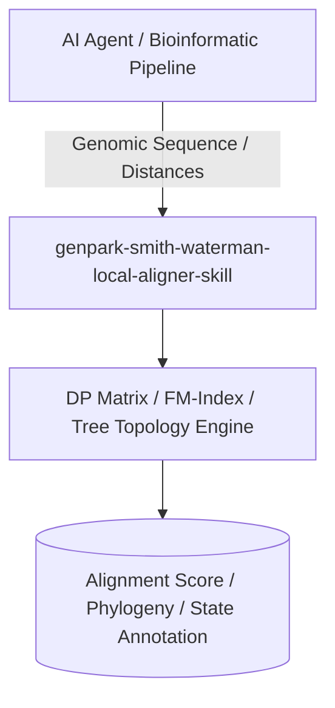

# genpark-smith-waterman-local-aligner-skill

[](https://github.com/alphaparkinc/genpark-smith-waterman-local-aligner-skill/actions)
[](https://opensource.org/licenses/MIT)
[](https://www.python.org/downloads/)

> Smith-Waterman local sequence alignment algorithm identifying maximal local similarity regions between DNA, RNA, and protein sequences.

## Architecture



## Features
- Pure standard library Python implementation with strictly zero pip dependencies.
- Groundbreaking biological algorithms (Needleman-Wunsch, Smith-Waterman, BWT/FM-Index, NJ Trees, HMMs).
- Native Model Context Protocol (MCP) server support for AI agent bioinformatic analysis.

## Installation

```bash
git clone https://github.com/alphaparkinc/genpark-smith-waterman-local-aligner-skill.git
cd genpark-smith-waterman-local-aligner-skill
```

## Quickstart

```bash
python example_usage.py
```
